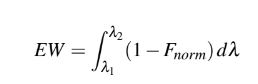
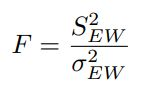
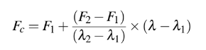
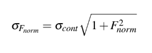
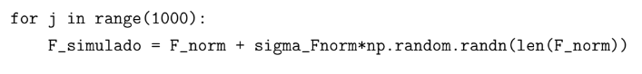
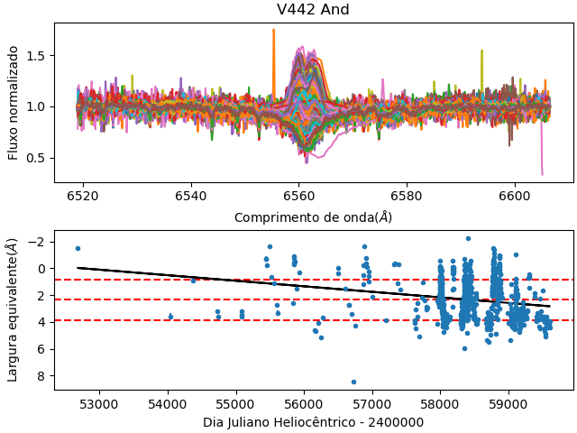
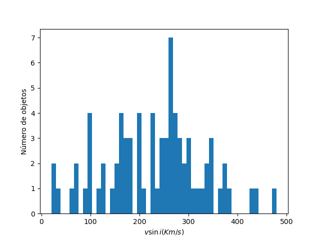
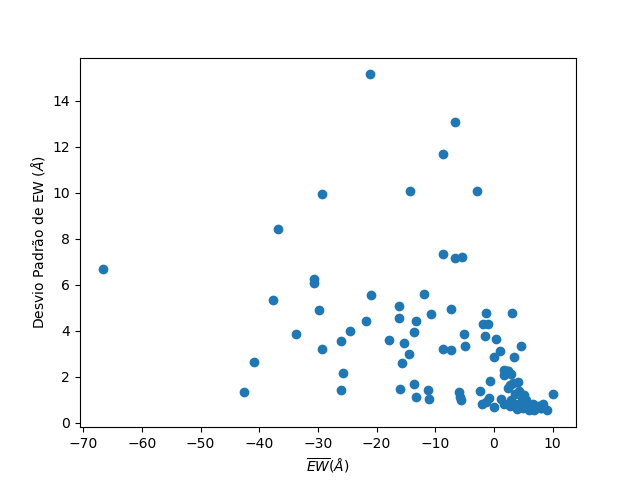
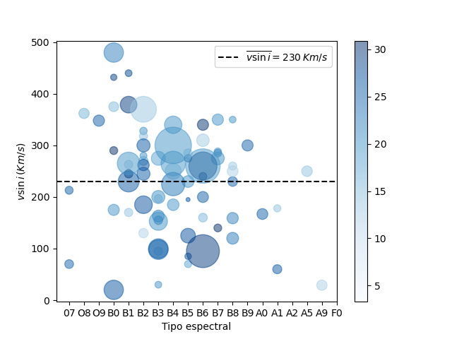

# Variability of the Hα line in Be stars:

For my undergraduate thesis in astrophysics, I conducted a statistical study on the variability of the H-alpha line in Be stars.

RESUME

Classical Be stars are B-type stars, but also late-O or recent A-type stars, which present
or have already presented one or more lines of the Balmer series in emission. These stars
may show a high variability in the Hα line, in different time scales. The paper of Jones et al.
(2011) developed a quantitative analysis of the variability of Hα for a set of stars through the
statistical F test, in addition to estimating whether such stars showed a trend of increasing or
decreasing line profile during the observed period. Inspired by this paper, we performed a
similar analysis, albeit with some of our own methods, for a larger sample of stars and a longer
period of observations, through spectra made available by the BeSS database. As a result, we
produced a series of graphs that indicate the behavior of the variability of Hα for a sample of
100 Be stars, and we discovered some relationships between the variability of Hα and the mean
intensity of the line (EW), v sini, and spectral type. We also saw that the spectral subtype also
relates to these same quantities, with stars with greater v sini, EW and standard deviation of
EW, almost all recent B-type stars.

OBJECTIVE

The objective of this work is to conduct a study on the category of stars known as Classical Be stars, using existing spectra made publicly available by the BeSS database. More specifically, it aims to investigate the variability of the Hα line flux and its potential correlation with fundamental properties of the stars.

METODOLOGY

In the codes contained in this repository, I computationally performed the steps described below, obtaining data for the construction of a table and graphs that represent the analysis based on data obtained from: http://basebe.obspm.fr/basebe/

To measure the variation of the Hα line, it is necessary to calculate the Equivalent Width (EW) of the emission line. The formula for Equivalent Width is:

The EW represents the line's intensity. By convention, negative values of EW indicate emission lines, and positive values indicate absorption lines.

The variation was quantified using a statistical test called the F-test, which compares the variances of two populations through the formula:

We used the F-test to compare the uncertainty of the EW measurement with the variance of the EW measurement over time. If the null hypothesis is true, i.e., if the variances are comparable, it means that there is no variation in the equivalent width of the star in question. If the null hypothesis is rejected, it means that the Hα emission has undergone variation.

For the completion of this work, we obtained the spectra of the 100 most observed classical Be stars, that is, those with the most spectra available in the BeSS database. From this, we made a selection to use only the spectra containing the region of interest – λ = 6562.8 Å, the Hα emission region – followed by the normalization of the spectrum for the subsequent calculation of EW.

For the normalization of the line profile, first, we obtained the flux and wavelength data through the FITS files obtained from BeSS. With this data, and selecting the region of interest – around Hα – we calculated the continuum flux, approximating it with a straight-line equation:

 λ is the wavelength of the spectrum, λ1 is the minimum wavelength, and λ2 is the maximum wavelength within the region delimited between (6519.0 - 6606.5) Å. F1 corresponds to the median flux of the left edge – defined as all values from λ1 to λ1+5 Å, exclusive – and F2 corresponds to the median flux of the right edge – similarly, from λ2 -5 Å to λ2.

 Finally, we obtained the normalized flux by dividing the flux by the continuum flux.

 F Test

 For the application of the F-test, we used the temporal variance of the EW measurement and the uncertainty of EW (sigmaEW).

To determine sigmaEW, we used two methods. Method 1 follows the approach adopted by Jones et al. (2011), where sigmaEW = 3% EW. Method 2 involves a statistical procedure, using a bootstrapping method.

STATISTICAL METHOD

From the uncertainty propagation formula, we arrived at the following formula for the uncertainty of the normalized flux:

To obtain the sigma of continuum, we created a vector containing the wavelengths of the left and right edges, this time with limits λ1 +10 Å and λ2 −10 Å, respectively, and calculated its standard deviation.

With the sigma of ontinuum value obtained above, we then used a bootstrapping method, assuming that the uncertainty of the spectrum is Gaussian. We recalculated EW by emulating, from the actual data obtained (normalized flux and its uncertainty), fluctuations in the measurement of EW to obtain a standard deviation. This was done, initially, through the loop:

which generates a sequence of numbers in a Gaussian distribution. Subsequently, we calculated the value of simulated EW from each simulated F, according to the formula for calculating EW. Finally, we obtained the uncertainty of EW by calculating the standard deviation of the simulated EWs.

To measure the reliability of the statistical test result, we used the confidence level \(C\), which was defined as C = 1 - p, where p is the significance level (p-value).

RESULTS

As a result, we obtained a series of plots representing our analysis.

For each object in the sample, we constructed a figure displaying the normalized flux vs. wavelength of all overlaid spectra in its upper panel. In its lower panel, we plotted EW vs. the observation period (HJD) of each spectrum. The lower panel also featured a linear fit to indicate the increasing or decreasing trend of EW (we referred to the fit coefficient as the rate of change (dEW/dt)), as well as horizontal lines representing the mean value of EW and its variation within 1σ, where σ here is the square root of the temporal variance of EW, corresponding to the standard deviation of the EW value over time.

We also created histograms for the following quantities: the number of spectra, observation time, EW, annual rate of change of EW, F, and vseni. I will provide here only one example:

We also created plots that relate the temporal variation of EW to the mean value of EW, to vseni, and to the spectral type of the star. 

Additionally, we also explored the relationship between spectral type and vseni, and between spectral type and the Mean Equivalent Width (each point contains an area proportional to the number of observations of the object, and the shade indicates the observation period in years, as illustrated in the color bar).

